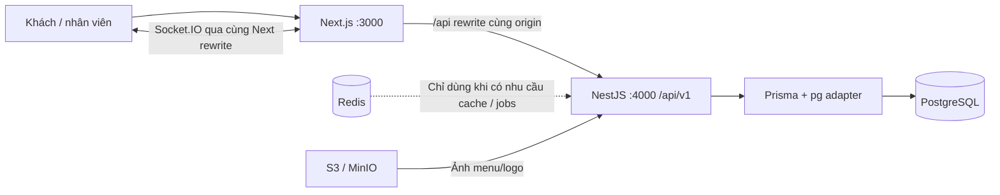

# DineFlow — kiến trúc và phạm vi

## Phạm vi thực hiện

Repository ban đầu chỉ có README và Requirement.md. Hiện có **Phase 1–7**, SaaS foundation, SaaS 2 và SaaS 3: đăng ký Owner tạo tenant trống, admin nền tảng riêng, tenant lifecycle/platform audit, cùng tài khoản tạo/chuyển nhiều nhà hàng, xác minh email, recovery/đổi mật khẩu và MFA admin. Xem [SaaS](saas.md), [Multi-restaurant verification](tenancy-verification.md) và [bảo mật tài khoản](security.md). Production vẫn còn trong roadmap; browser dùng FE do người dùng mở.

Phase 1 chạy được: workspace pnpm; Next.js App Router tiếng Việt; NestJS REST + Swagger; PostgreSQL + Prisma + migration; Redis qua Compose; kiểm tra môi trường; seed; đăng nhập/đăng xuất nhân viên, JWT, refresh rotation, RBAC; dashboard đọc nhà hàng, vai trò và số lượng cấu hình từ database. Không đưa đơn hàng giả vào dashboard.

Phase 2 thêm settings/menu/modifiers, upload ảnh S3/MinIO, bàn và QR. Phase 3 thêm staff-opened dining sessions, guest admission, menu/cart/checkout, snapshot và lịch sử đơn riêng. Phase 4 thêm dashboard vận hành, xác nhận/từ chối, kitchen display, phục vụ và đơn thủ công. Phase 5 thêm Socket.IO, tracking, yêu cầu phục vụ/thanh toán và reconnect/refetch. Phase 6 thêm bill cả phiên, discount có hạn mức, cash/chuyển khoản thủ công, đóng phiên nguyên tử và receipt snapshot/in. Phase 7 thêm doanh thu COMPLETED theo timezone, lịch sử mọi phiên, audit an toàn và quản lý nhân viên. API đã đóng gói Docker, web chạy trên host bằng terminal. Schema dự kiến cho MVP được migration ngay trong foundation để kiểm chứng quan hệ và constraints; các chức năng triển khai khi tới phase tương ứng.

## Kiến trúc



Monolith modular, nhiều Restaurant là các tenants riêng. Mỗi đăng ký tạo tenant đầu tiên; Owner tạo thêm tenant bằng cùng User. Một AuthSession chỉ thuộc một membership. Đăng nhập nhiều membership yêu cầu chọn nhà hàng; switch tạo phiên đích, thu hồi phiên nguồn và giữ hạn tuyệt đối. Dữ liệu nghiệp vụ có restaurantId và membership riêng; scope lấy từ principal backend, không tin restaurantId từ client. Header X-DineFlow-Restaurant chỉ đối chiếu expected scope để chặn tab cũ, không chọn tenant. Chưa có subscription/charging, worker, Redis adapter hoặc queue. REST là nguồn dữ liệu; sự kiện chỉ được phát sau commit, kết nối ban đầu/reconnect luôn refetch.

Web sử dụng cùng origin `/api/v1` qua Next rewrite. Cookie access/refresh HttpOnly, SameSite=Lax; Secure khi production. Access JWT 15 phút, refresh opaque 7 ngày và rotation với hạn tuyệt đối của phiên; chỉ lưu SHA-256 refresh token. Guard kiểm tra phiên, user và membership còn active trong DB ở mỗi request. Role không được lấy từ JWT cũ. Trình duyệt gửi `X-DineFlow-Client: web` cùng JSON cho mutation; backend bắt buộc header này và kiểm tra Origin nằm trong allowlist. Không bật trust proxy mặc định.

Refresh dùng row lock theo AuthSession. Token đã dùng bị gửi lại sẽ revoke cả phiên, gồm access JWT đang còn hạn. Logout revoke phiên và clear cookies. Web gộp refresh trong mỗi tab, không retry mutation tự động; nếu nhiều tab refresh đồng thời, policy nghiêm ngặt có thể yêu cầu đăng nhập lại. Access/refresh tokens không trả trong JSON hoặc lưu localStorage. Login bị rate limit theo email chuẩn hóa + IP trong một API instance; trước khi scale cần shared throttler storage.

## Cấu trúc

```text
apps/
  api/
    prisma/                 # schema, SQL migrations, seed
    src/
      auth/                 # cookies, rotation, guards, policies, public signup
      platform/             # separate opaque admin sessions, tenant lifecycle/settings/audit
      common/               # validation, errors, request metadata
      config/               # Zod environment validation
      database/             # Prisma lifecycle
      health/               # liveness, DB readiness
      restaurant/           # dashboard thật + scope
      menu/                 # categories, items, modifiers
      tables/               # setup, public QR context
      storage/              # S3 abstraction, image validation
      dining-sessions/      # open, empty close, cleaning
      orders/               # guest/manual orders, pricing, staff/kitchen transitions
      payments/             # scoped bills, discounts, settlement, immutable receipts
      reports/              # completed revenue, history, safe activity reads
      staff/                # scoped staff management and session revocation
      realtime/             # single-use tickets, scoped socket delivery, revocation checks
      generated/            # Prisma, không commit
    test/                   # integration HTTP với PostgreSQL thật
  web/
    src/app/(auth)/staff/login/
    src/app/(workspace)/staff/dashboard/
    src/components/ui/      # shadcn-style primitives
    src/features/auth/
    src/features/setup/
    src/features/ordering/  # staff tables, customer provider/menu/cart/history
    src/features/operations/ # staff orders, kitchen display, manual order provider
    src/features/realtime/  # connection status, notifications, table/staff service requests
    src/features/billing/   # cashier, guest totals, explicit payment/recovery, printing
    src/features/admin/     # reports, historical orders, activity and staff
    src/app/(workspace)/admin/
    src/app/t/[tableCode]/  # nested layout preserves cart across navigation
    src/lib/                # typed API client
packages/shared/            # DTO Zod, role labels, domain state machines
docs/                       # ERD, state models, roadmap, hướng dẫn
scripts/                    # tạo env local, smoke checks
docker/                     # API runtime/migration targets, container URL routing
compose.yaml                # API + migration (profile api), PostgreSQL, Redis, MinIO
```

Nest bổ sung modules tables, dining-sessions, menu, orders, kitchen, payments, realtime, reports, storage, audit khi phase tương ứng bắt đầu. Không tạo module rỗng để giả hoàn thành.

## Ranh giới transaction

- Mở bàn: khóa row DiningTable; kiểm tra AVAILABLE; tạo OPEN session; OCCUPIED. Partial unique index chặn hai phiên active trên một bàn.
- Phase 3 dùng thứ tự khóa Restaurant → DiningTable → DiningSession, chung với setup mutations. Việc sửa giá/archive không xen vào transaction chụp snapshot; đóng phiên rỗng và tạo đơn chỉ có một kết quả hợp lệ. Restaurant lock tuần tự hóa writers trong từng tenant; cần đánh giá tải trước khi tăng quy mô.
- Tạo đơn: khóa DiningSession; xác minh GuestSession chưa hết hạn và đúng scope; kiểm tra OPEN; lookup idempotency key + request hash; kiểm tra menu/modifiers; tính giá server; snapshot; tạo đơn/items/audit trong một transaction. Cùng key và payload trả đơn cũ; key khác payload trả 409.
- Menu: update không sửa snapshot của đơn cũ. Archive thay vì xóa dữ liệu đã phát sinh nghiệp vụ.
- Trạng thái đơn (Phase 4): khóa Restaurant → DiningTable → DiningSession → Order, kiểm tra phiên active và permission + trạng thái hiện tại so với `from`. Chuyển trạng thái, lưu timestamp tương ứng và audit trong cùng transaction; stale request trả 409. Chế biến/phục vụ vẫn được phép khi PAYMENT_REQUESTED, nhưng không khi CLOSED.
- Yêu cầu phục vụ (Phase 5): cùng Restaurant → Table → Session, thêm Request lock khi chuyển trạng thái. Partial unique index chỉ cho một request cùng type chưa RESOLVED trong phiên; retry cùng loại trả request cũ. Yêu cầu REQUEST_PAYMENT và OPEN → PAYMENT_REQUESTED, timestamps/audit ghi cùng transaction. Tiếp nhận/hoàn tất đối chiếu `from`, không bỏ bước/mở lại; cooldown 30 giây chặn gọi liên tục sau resolve. Đóng phiên rỗng tự resolve các request còn active trong transaction đóng.
- Thanh toán (Phase 6): khóa Restaurant → DiningTable → DiningSession; cần ít nhất một đơn non-CANCELLED và tất cả đã SERVED. Tổng hợp snapshot QR/STAFF, đối chiếu revision SHA-256, discount/hạn mức và paidAmount đúng total. Tạo COMPLETED payment/receipt snapshot, CLOSED session, NEEDS_CLEANING table, revoke guest sessions, resolve các request active và audits trong cùng transaction. Unique payment/session ngăn lần hai; replay cùng key/payload/user trả receipt gốc kể cả phiên đã đóng. Chỉ cash hoặc bank transfer đã được nhân viên xác nhận nhận tiền thủ công.
- Không nhận thêm đơn khi PAYMENT_REQUESTED hoặc CLOSED; nhân viên có thể mở lại OPEN trước thanh toán nếu khách muốn gọi thêm. Đóng không thanh toán chỉ với phiên không có đơn tính tiền và lý do audit.

Đóng không thu tiền cho phiên OPEN/PAYMENT_REQUESTED không có đơn non-CANCELLED: bắt buộc lý do, giữ đơn hủy, không tạo Payment, revoke guests/resolve requests và chuyển bàn sang NEEDS_CLEANING trong cùng transaction. OWNER/MANAGER/CASHIER được đóng; OWNER/MANAGER/WAITER được mở và dọn bàn. Bốn role ngoài KITCHEN đọc bill/receipt và yêu cầu/mở lại trước thanh toán; mở lại cần lý do và resolve REQUEST_PAYMENT đang chờ. Phiên CLOSED không mở lại.

Bill dùng BigInt để tính VND nguyên và kiểm tra Int32 overflow: net = subtotal − discount; phí làm tròn half-up trên net; thuế làm tròn half-up trên net + phí đã làm tròn. Rates lấy từ Restaurant, mặc định 0. Giảm giá chỉ áp dụng sau mọi đơn hợp lệ đã SERVED; OWNER/MANAGER tới subtotal, CASHIER theo cashierMaxDiscountBps (mặc định 0). Khi cap đổi, backend kiểm tra cả giảm giá đã lưu lúc thanh toán. Bill revision bao gồm trạng thái/order snapshots/totals/cấu hình; stale revision trả 409.

Receipt lấy JSON snapshot tại thời điểm payment, không tính lại từ menu/settings/table hiện tại. SQL trigger từ chối UPDATE Payment. Payment cũ thiếu snapshot trả 409, không tạo biên nhận từ dữ liệu hôm nay. Web giữ payload/key theo staff user/session trong sessionStorage trước khi gửi, khôi phục qua reload và có nút kiểm tra receipt theo session; không tự retry POST. Network/5xx hoặc lỗi lần retry giữ nguyên key vì lần trước có thể đã commit. Một lần thanh toán toàn bộ; chưa có partial/split/refund.

Guest token opaque 32 bytes, SHA-256 trong DB, TTL mặc định 4 giờ và cookie HttpOnly/SameSite=Lax/Secure theo env, Path theo public table code. Public menu trả active session ID để admission kiểm tra đúng phiên đã thấy; ID này không phải credential. Mọi guest read/write xác minh token, expiry/revocation, table code và current dining session trong transaction. Lịch sử chỉ lọc guestSessionId của token; không dùng QR để đọc đơn khách trước. Guest bill chỉ trả tổng tiền/số đơn/trạng thái phiên hiện tại, không trả orders/items/ghi chú/guest IDs/lý do giảm giá của người khác. Web không chạy staff refresh cho API guest.

Giỏ và request retry lưu sessionStorage theo table/session/guest, không lưu credential. Checkout giữ payload/key cố định nếu mất phản hồi hoặc gặp 5xx; tải lại trang rồi thử lại dùng cùng key. Rejection 4xx của lần đầu cho phép sửa giỏ; rejection của lần retry vẫn giữ key vì đơn trước có thể đã commit. Backend lookup cùng key/hash/guest trước khi kiểm tra menu để replay trả snapshot cũ. `expectedTotal` chỉ xác nhận khách đã xem tổng tiền; backend tự tính toàn bộ giá và trả 409 khi giá đổi.

Đơn thủ công dùng lại pricing/snapshot backend và menu/cart components. GET menu và POST đơn yêu cầu staff auth, role và scope session; chỉ tạo đơn trong OPEN. Source STAFF, guestSessionId null, request hash gắn userId nhân viên; cùng key không thể được nhân viên khác replay. Giỏ lưu theo staff user/session, không tạo guest credential. Đơn thủ công vẫn cần xác nhận; guest history không chứa đơn STAFF. Staff/kitchen queues được phân trang và đếm trong RepeatableRead transaction, chỉ lấy phiên OPEN/PAYMENT_REQUESTED của nhà hàng hiện tại. Socket hint invalidate queries rồi REST lấy dữ liệu; nút cập nhật vẫn dùng được khi socket lỗi.

## Realtime Phase 5

POST staff `/realtime/ticket` hoặc guest `/public/tables/:code/realtime-ticket` chịu HTTP auth, CSRF và throttling. Vé opaque 32 bytes, SHA-256 key trong memory, TTL 60 giây, tiêu thụ một lần khi handshake; không gửi cookie JWT/guest token qua socket auth, không lưu vé trong browser storage. Vé staff giữ principal/token ở server; vé guest giữ guest/table/session/code đã kiểm chứng. Socket.IO từ chối Origin sai hoặc Sec-Fetch-Site cross-site; polling cùng origin có thể không gửi Origin, nhưng vẫn bắt buộc vé hợp lệ.

Room do server chọn: staff theo restaurant/role; guest theo guest ID và phiên. Không có client-selected join/subscription hay socket mutation. Delivery đối chiếu identity từng socket: order hint chỉ tới guest tạo đơn; kitchen chỉ nhận đơn đã xác nhận/các bước bếp và table hints; service requests chỉ tới staff có quyền và guests cùng phiên. Phase 6 thêm billing.updated cho staff có quyền/guest đúng phiên và payment.completed chỉ tới staff ngoài KITCHEN. Payload chỉ là IDs/kind/time, không có món/giá/guest ID/staff identity. Guest request DTO chia sẻ trạng thái phục vụ tại bàn, không chia sẻ đơn của người khác.

Auth được kiểm tra lại trước mỗi event và mỗi 15 giây; logout, role/membership thay đổi, hết hạn guest/token hoặc session đóng sẽ disconnect. Closing hint chỉ chứa scope đã biết, gửi trước disconnect guest bị revoke. Client lấy vé mới với backoff 1–30 giây, refetch sau ready và khi tab visible; offline cập nhật badge và đóng socket. Không retry mutation tự động. Staff refresh dùng cơ chế GET hiện có trước khi xin vé mới.

Mỗi publication nằm sau transaction commit và không làm rollback nghiệp vụ khi delivery lỗi. Events best-effort, không có replay/outbox: reconnect/tab visible/manual refresh bù dữ liệu bị lỡ bằng REST. Tickets/connections/rooms chỉ ở một API instance, tối đa 8 connections/principal và 10.000 vé chưa hết hạn; chưa benchmark fan-out/auth revalidation. Redis adapter, vé dùng chung và durable outbox cần đánh giá trước scale. Socket.IO dùng path không trailing slash qua Next để tránh 308 redirect; browser đã kiểm tra cả WebSocket upgrade và polling fallback.

## Admin/Analytics Phase 7

OWNER/MANAGER đọc `/reports/revenue`, `/reports/orders`, `/reports/orders/:id`, `/reports/activity` và quản lý `/staff`. Scope chỉ từ principal; filters strict, ID ngoài scope trả 404. Khoảng ngày gồm cả hai đầu, tối đa 366 ngày; SQL tạo mốc UTC từ ngày local/timezone nhà hàng, bao gồm ngày DST dài 23/25 giờ. Revenue lấy Payment COMPLETED theo completedAt; không cộng đơn chưa thanh toán/hủy. Các tổng, buckets, methods và best-sellers đọc trong cùng RepeatableRead transaction. SUM dùng BigInt, kiểm tra giới hạn safe integer khi trả JSON; không giới hạn tổng nhiều payments theo Int32 của từng bill.

History dùng ngày tạo đơn, chứa cả phiên CLOSED, giữ snapshots món/tùy chọn/giá và các mốc trạng thái; tên bàn được ghi rõ là tên hiện tại, receipt giữ tên lúc thanh toán. Best-sellers nhóm menu ID + tên snapshot, lấy món của phiên có eligible completed payment, bỏ CANCELLED; tiền món trước discount/fees/tax. Activity chỉ trả scalar details được whitelist, không trả JSON tùy ý hoặc credentials.

Staff mutation khóa Restaurant và recheck actor trong transaction, kiểm tra updatedAt. MANAGER không quản lý OWNER; không tự đổi role/khóa/reset mật khẩu qua màn hình quản lý; luôn còn ít nhất một OWNER active. User/email mới không được gắn vào tài khoản có sẵn của tenant khác. Với User có memberships nhiều nhà hàng, chặn quản lý sửa tên/password toàn cục; role/trạng thái vẫn scoped. Đổi role/khóa revoke AuthSessions của membership. Reset mật khẩu tăng credentialVersion, vô hiệu account tokens/MFA challenges và thu hồi phiên; password scrypt và audit ghi nguyên tử, không ghi secret. Reenable không khôi phục phiên cũ. User tự đổi mật khẩu ở `/staff/security` với mật khẩu hiện tại; chưa có email invitation hoặc xóa tài khoản.

AccountService khóa User trước khi phát hành/tiêu thụ token hoặc đổi credential; request đồng thời không dùng token hai lần. Link email chứa fragment, không nằm trong HTTP request/referrer; frontend xóa fragment và chỉ submit khi người dùng xác nhận. EmailOutbox ghi cùng transaction đăng ký/phát hành token, worker claim bằng SKIP LOCKED và lease, retry tối đa năm lần trước expiry. Local gửi SMTP Mailpit; production gửi Resend HTTP có Idempotency-Key. Platform password login chỉ tạo MfaChallenge năm phút; TOTP đúng, counter chưa dùng và user/admin/version còn hợp lệ mới tạo PlatformSession tám giờ. Secret/challenge setup mã hóa, QR API no-store. Migration thu hồi platform sessions cũ. Các request được guard kiểm tra lại user/session/version từ DB.

API Docker chạy Linux generated client/compiled code và production dependencies; migration one-shot hoàn tất trước API readiness. `.env` không nằm trong image. Đây là cấu hình local HTTP, không phải xác nhận production deployment. Web Next do người dùng chạy trên host.

## Lựa chọn phiên bản

Node >=22.12, pnpm 9; Next.js 16.4 / React 19.3; NestJS 12.1; TypeScript 6 strict; Prisma **7.10 stable** (không lấy dist-tag latest đang trỏ Prisma 8 RC), pg adapter; Tailwind 4; TanStack Query; RHF + Zod. Lockfile cố định phiên bản thực tế. Built-in Node test runner chạy JavaScript đã compile để kiểm thử đúng decorator metadata của Nest.

Tài liệu tham chiếu chính thức: [Next installation](https://nextjs.org/docs/app/getting-started/installation), [Nest migration/runtime requirements](https://docs.nestjs.com/migration-guide), [Prisma generator](https://www.prisma.io/docs/orm/v7/prisma-schema/overview/generators), [Prisma pg adapter](https://www.prisma.io/docs/orm/v7/prisma-client/setup-and-configuration/introduction).
