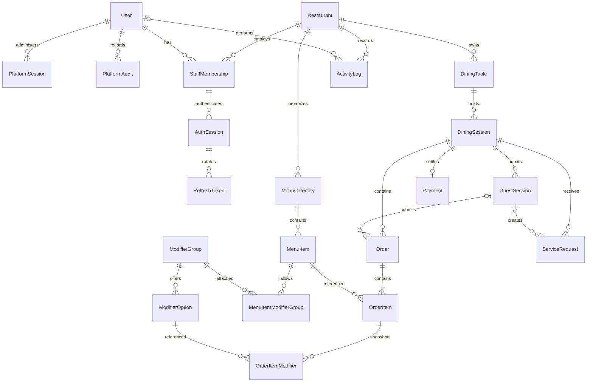

# Database ERD

SaaS migration `202610090007_saas` thêm Restaurant.status/suspensionReason, User.isPlatformAdmin (mặc định false) và PlatformSession/PlatformSettings/PlatformAudit. Tenant cũ ACTIVE, dữ liệu giữ nguyên. Platform session không dùng StaffMembership; settings có singleton constraint, audits FK về admin User. Xem [SaaS](saas.md).

Phase 7 dùng các bảng hiện có, không thêm migration. Revenue dựa trên Payment COMPLETED/completedAt và tiền snapshot; best-sellers đọc OrderItem snapshots của phiên đã thanh toán, bỏ CANCELLED. History/audit vẫn restaurant-scoped và giữ dữ liệu phiên CLOSED. Staff mutations dùng StaffMembership/User/AuthSession/ActivityLog trong transaction, không xóa người thao tác hoặc lịch sử. API Docker chạy migrate deploy trước startup, dùng nguyên named volume PostgreSQL hiện có.

UUID cho PK, random base64url publicCode (24 bytes) cho bàn, random token chỉ lưu hash cho guest/auth. Order number tuần tự chỉ dùng hiển thị nhân viên, không làm credential. Giá tiền integer VND >=0, tổng tối đa Int32; services kiểm tra overflow trước khi ghi. Fee/tax lưu basis points 0..10000, mặc định 0, không hard-code mức thuế. Restaurant.cashierMaxDiscountBps giới hạn giảm giá của CASHIER, mặc định 0.

Tenant scoping: composite FK `(id, restaurantId)` giữa table/session, category/item, modifiers, order/session/item/payment/service request. Guest scope còn ràng buộc `(guestSessionId, diningSessionId)`. Membership của phiên auth bắt buộc thuộc cùng user. Đây là chuẩn bị mở rộng, chưa phải multi-tenant SaaS.

Mỗi bàn chỉ có một OPEN/PAYMENT_REQUESTED session: PostgreSQL partial unique index trong SQL migration. Payment toàn phần một lần: unique diningSessionId; payment transaction thất bại rollback nên không cần lưu payment FAILED trong MVP. Order unique `(diningSessionId, idempotencyKey)`, có requestHash. ModifierOption không được lặp trong một item; kiểm tra min/max selection ở service khi đặt món. Snapshot tên/giá/group/option độc lập dữ liệu menu.

Foreign keys dùng Restrict với lịch sử kinh doanh; archive menu/table/category và disable user/membership. Session CLOSED và payment giữ vĩnh viễn. Timestamps dùng timestamptz. SQL bổ sung CHECK tiền >=0, quantity >0, discount <= subtotal, selection range, basis points, session closedAt và refresh chronology; không dựa riêng vào validation frontend.

Phase 6 thêm DiningSession.discount/discountReason, Payment.idempotencyKey/requestHash/receiptSnapshot. Migration `202610090005_billing` và `202610090006_payment_integrity` thêm CHECK discount/reason/cap, bộ key/hash/snapshot cùng có hoặc cùng null, hash không null và đúng SHA-256 khi có receipt, công thức làm tròn fee/tax cho payment có snapshot. Payment legacy thiếu cả bộ ba vẫn đọc được ở DB; API receipt trả 409 nếu thiếu snapshot.

Receipt JSON chứa restaurant/table, rates, discount/totals, order/item/modifier snapshots và thời điểm đóng; không phụ thuộc giá/tên hiện tại. Trigger BEFORE UPDATE từ chối mọi sửa Payment, kể cả cập nhật snapshot; không có API xóa Payment. Restrict FK giữ lịch sử. Fixture tests chỉ DELETE dữ liệu đúng tenant ngẫu nhiên đã tạo. Một payment/session; đóng không thu tiền giữ đơn CANCELLED và không tạo payment.

Database không tự thực thi toàn bộ state machine. Services đã triển khai tới Phase 6 kết hợp Restaurant → Table → Session row locks, transaction, role/scope và domain transition policy; các chức năng báo cáo còn thuộc Phase 7.
