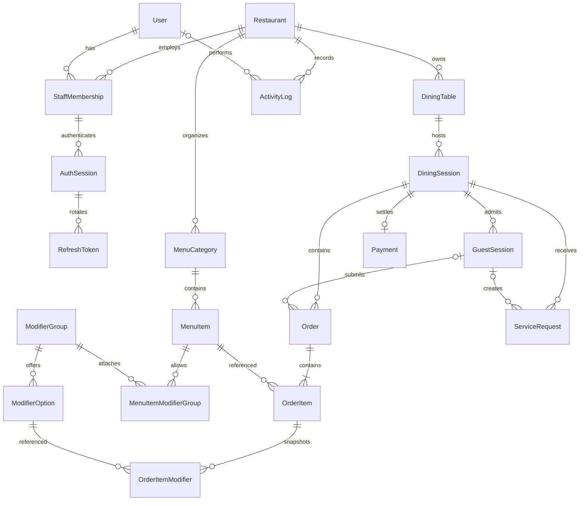

# Database ERD

UUID cho PK, random base64url publicCode (24 bytes) cho bàn, random token chỉ lưu hash cho guest/auth. Order number tuần tự chỉ dùng hiển thị nhân viên, không làm credential. Giá tiền integer VND >=0, tổng tối đa Int32; API các phase sau phải kiểm tra overflow trước khi ghi. Fee/tax lưu basis points 0..10000, mặc định 0, không hard-code mức thuế.

Tenant scoping: composite FK `(id, restaurantId)` giữa table/session, category/item, modifiers, order/session/item/payment/service request. Guest scope còn ràng buộc `(guestSessionId, diningSessionId)`. Membership của phiên auth bắt buộc thuộc cùng user. Đây là chuẩn bị mở rộng, chưa phải multi-tenant SaaS.

Mỗi bàn chỉ có một OPEN/PAYMENT_REQUESTED session: PostgreSQL partial unique index trong SQL migration. Payment toàn phần một lần: unique diningSessionId; payment transaction thất bại rollback nên không cần lưu payment FAILED trong MVP. Order unique `(diningSessionId, idempotencyKey)`, có requestHash. ModifierOption không được lặp trong một item; kiểm tra min/max selection ở service khi đặt món. Snapshot tên/giá/group/option độc lập dữ liệu menu.

Foreign keys dùng Restrict với lịch sử kinh doanh; archive menu/table/category và disable user/membership. Session CLOSED và payment giữ vĩnh viễn. Timestamps dùng timestamptz. SQL bổ sung CHECK tiền >=0, quantity >0, discount <= subtotal, selection range, basis points, session closedAt và refresh chronology; không dựa riêng vào validation frontend.

Phase 1 chỉ sử dụng auth, restaurant và số lượng seed. Các bảng còn lại là nền tảng cho phase sau. Database không tự thực thi toàn bộ state machine; future services phải kết hợp row lock, transaction và domain transition policy.
