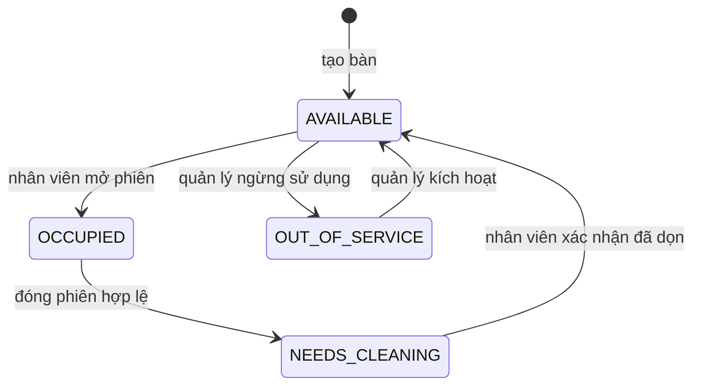
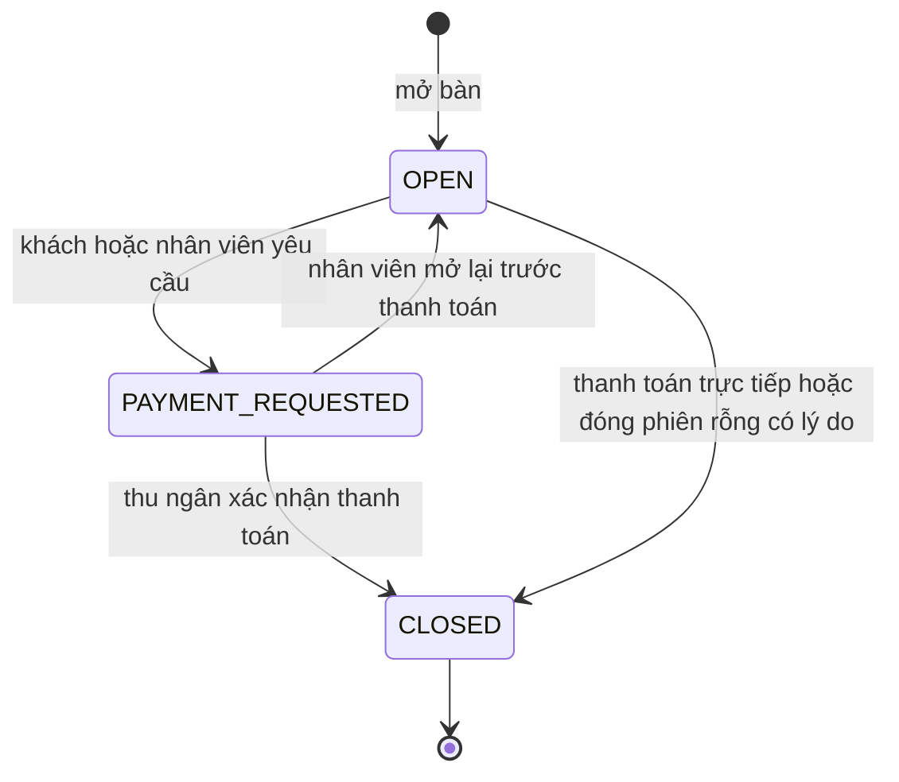
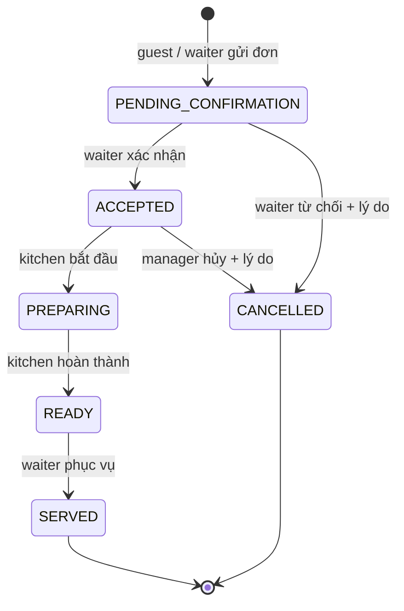
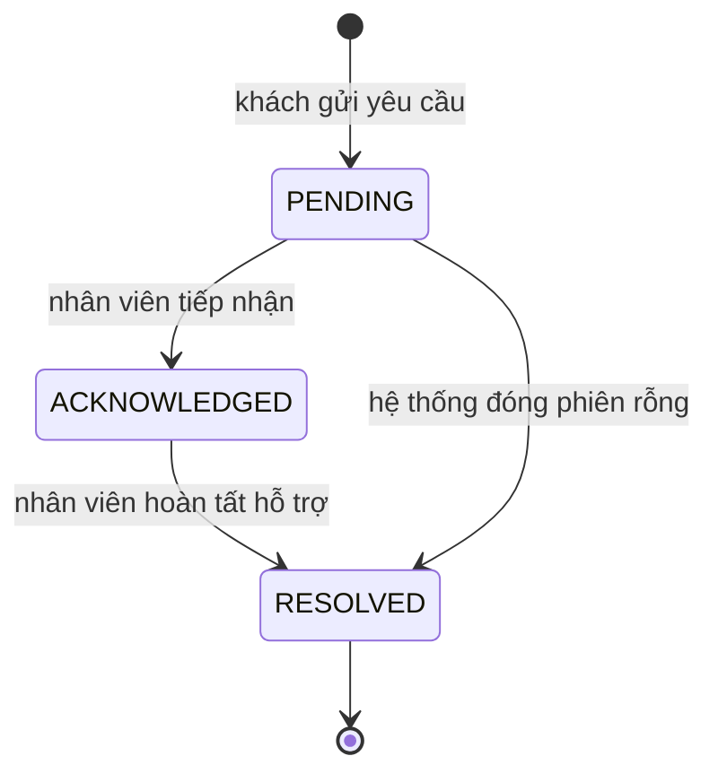

# State machines và quyền

Không cho CANCELLED sau PREPARING trong MVP; vấn đề món đã chế biến xử lý bằng quy trình điều chỉnh/refund sau này. Không cho chuyển ngược hoặc bỏ bước. Phase 4 đã triển khai toàn bộ order transitions, lưu acceptedAt/preparingAt/readyAt/servedAt/cancelledAt và audit; hủy bắt buộc reason 3–500 ký tự. Mỗi request kiểm tra role và scope restaurant/session, khóa dữ liệu và đối chiếu `from` với trạng thái thực tế; đơn đã bị người khác cập nhật trả 409. Quy tắc order transition dùng chung trong packages/shared được kiểm tra lại ở backend. Phase 5 triển khai OPEN → PAYMENT_REQUESTED qua yêu cầu khách; mở lại OPEN, ghi nhận tiền và đóng phiên có đơn thuộc Phase 6. Diagram session phía trên thể hiện policy MVP đầy đủ, không phải mọi cạnh đã có API.

CALL_STAFF / REQUEST_PAYMENT chỉ trong phiên OPEN hoặc PAYMENT_REQUESTED với guest token hợp lệ. Mỗi type chỉ có một request PENDING/ACKNOWLEDGED trong phiên; nhiều khách cùng bàn nhận cùng request khi gửi trùng. Yêu cầu đã RESOLVED không mở lại; gửi mới phải qua cooldown 30 giây. OWNER/MANAGER/WAITER tiếp nhận và hoàn tất cả hai loại; CASHIER chỉ REQUEST_PAYMENT; KITCHEN không đọc/xử lý service requests. Staff PATCH đối chiếu `from`, race chỉ một request thành công/audit. Hoàn tất REQUEST_PAYMENT không tạo Payment, không đóng bàn và không chuyển PAYMENT_REQUESTED về OPEN. `resolvedAt` chỉ có ở RESOLVED, được database constraint bảo vệ.

Đơn thủ công dùng source STAFF, không có guestSessionId và bắt đầu PENDING_CONFIRMATION như đơn QR. OWNER/MANAGER/WAITER được ghi đơn và xác nhận; KITCHEN chỉ được chuyển ACCEPTED → PREPARING → READY, WAITER ghi nhận READY → SERVED. CASHIER đọc danh sách đơn nhưng không chuyển trạng thái. OWNER/MANAGER được hủy ACCEPTED; WAITER chỉ từ chối PENDING_CONFIRMATION. Khi session PAYMENT_REQUESTED, đơn cũ vẫn được chế biến/phục vụ nhưng không nhận thêm đơn; CLOSED không cho chuyển trạng thái.

| Hành động | OWNER | MANAGER | CASHIER | WAITER | KITCHEN |
|---|---|---|---|---|---|
| Dashboard cơ bản | ✓ | ✓ | ✓ | ✓ | ✓ |
| Thiết lập menu/bàn | ✓ | ✓ | | | |
| Nhân viên | ✓ | Có giới hạn, không cấp OWNER | | | |
| Mở bàn / nhận đơn / phục vụ | ✓ | ✓ | | ✓ | |
| Bắt đầu / hoàn thành bếp | ✓ | ✓ | | | ✓ |
| Thanh toán / đóng phiên | ✓ | ✓ | ✓ | | |
| Giảm giá | ✓ | ✓ | Chỉ trong hạn mức được cấu hình | | |
| Báo cáo | ✓ | ✓ | | | |

Khách chỉ được đọc menu công khai, gửi/đọc đơn và service request trong **phiên đang hoạt động** được cấp token; không truy cập session lịch sử bằng QR cố định. QR không xác minh khách có mặt. Rate limit public API, nhân viên xác nhận đơn trước bếp; PIN/QR động có thể thêm sau.
