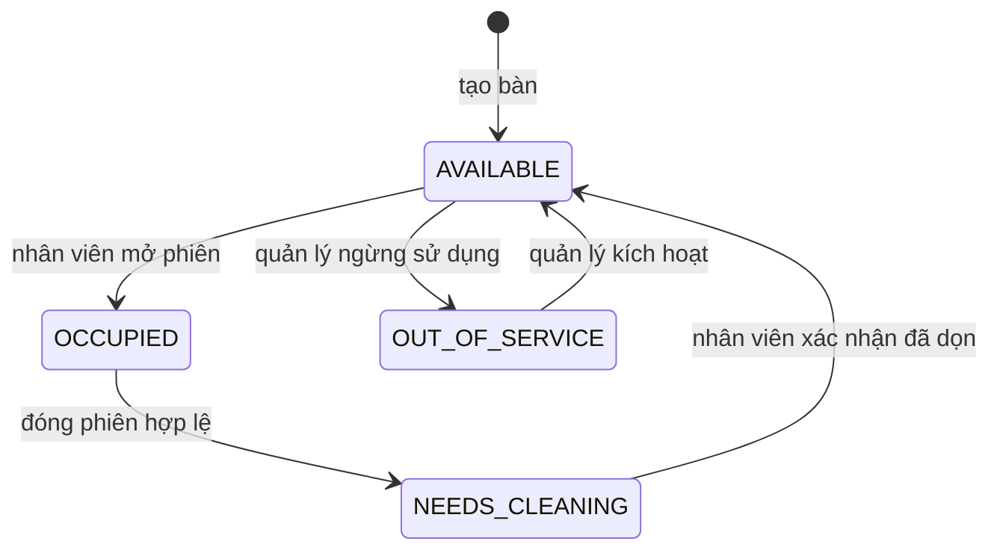
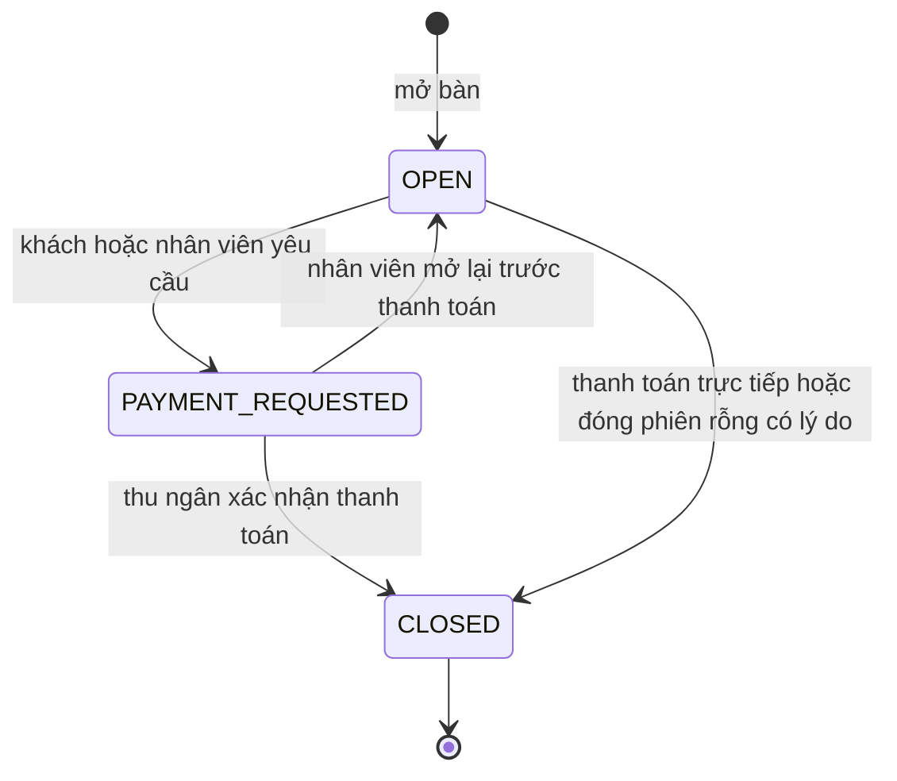
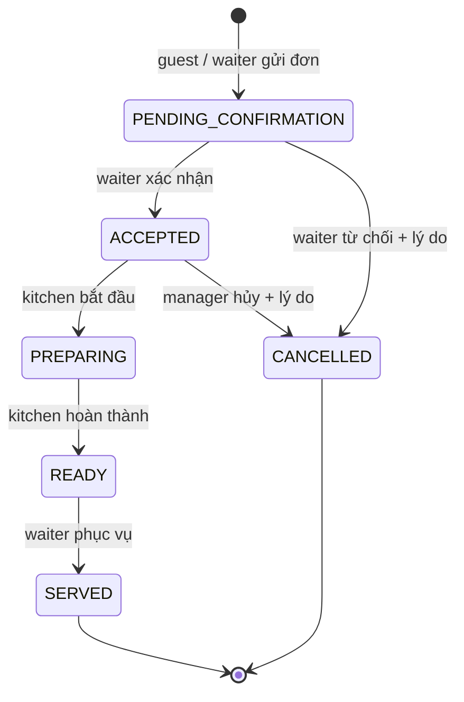

# State machines và quyền

Không cho CANCELLED sau PREPARING trong MVP; vấn đề món đã chế biến xử lý bằng quy trình điều chỉnh/refund sau này. Không cho chuyển ngược hoặc bỏ bước. Lưu acceptedAt/preparingAt/readyAt/servedAt/cancelledAt; hủy bắt buộc reason. Mỗi request kiểm tra cả role và scope restaurant/session. Quy tắc transition dùng chung trong packages/shared là policy dự kiến; endpoint nghiệp vụ triển khai ở Phase 3–6.

| Hành động | OWNER | MANAGER | CASHIER | WAITER | KITCHEN |
|---|---|---|---|---|---|
| Dashboard cơ bản | ✓ | ✓ | ✓ | ✓ | ✓ |
| Thiết lập menu/bàn | ✓ | ✓ | | | |
| Nhân viên | ✓ | Có giới hạn, không cấp OWNER | | | |
| Mở bàn / nhận đơn / phục vụ | ✓ | ✓ | | ✓ | |
| Bắt đầu / hoàn thành bếp | ✓ | ✓ | | | ✓ |
| Thanh toán / đóng phiên | ✓ | ✓ | ✓ | | |
| Giảm giá | ✓ | ✓ | Chỉ trong hạn mức được cấu hình | | |
| Báo cáo | ✓ | ✓ | | | |

Khách chỉ được đọc menu công khai, gửi/đọc đơn và service request trong **phiên đang hoạt động** được cấp token; không truy cập session lịch sử bằng QR cố định. QR không xác minh khách có mặt. Rate limit public API, nhân viên xác nhận đơn trước bếp; PIN/QR động có thể thêm sau.
